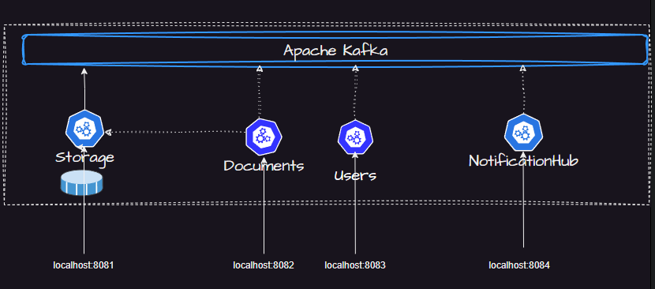
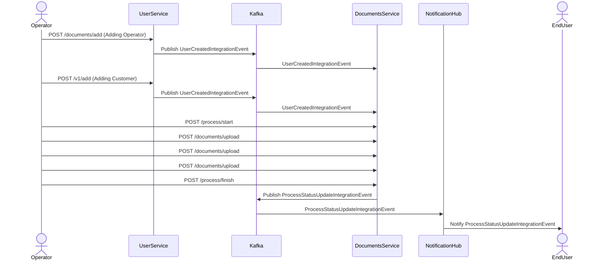

# Readme

## Steps to run the application

1. First run docker compose

```bash
 docker-compose up -d
```

2. Then go to swagger link [swagger link](http://localhost:8082/swagger)

3. add user with api call to users api
4. assign customer by api call to users api
5. start process for user/customer in documents api. You will get the process id and types of required documents
7. upload document with user id, customer id and document type(the required one)
8. each change process status will go through kafka to notification hub
9. after uploading all document you will be able to run /finish endpoint on process

## System schema

Here is the system architecture. The grayed out services were planned but not implemented



